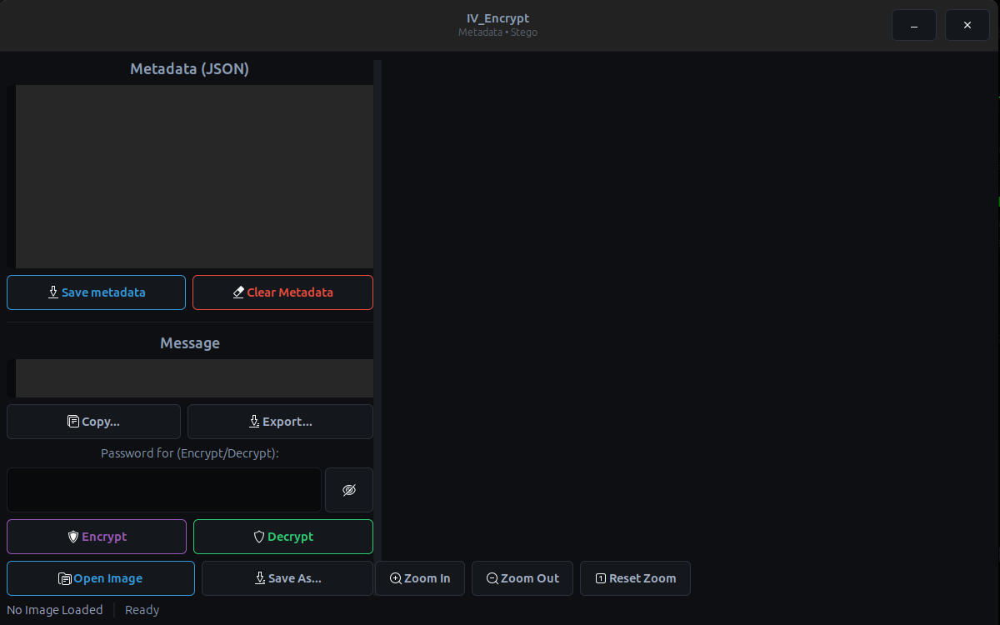

<div align="center">


# IV_Encrypt 
**A Professional Steganography and Metadata Cryptography Tool**

  

*Securely encrypt and conceal private messages within image pixels while managing raw Exif metadata natively.*

</div>

---

## 📸 Interface


*Featuring a high-visibility, cyberpunk-inspired GTK3 dark theme.*

---

## ⚡ Core Features

- **Advanced LSB Steganography:** Encrypt text using robust `libsodium` algorithms and seamlessly weave the ciphertext into the Least Significant Bits (LSB) of PNG image pixels.
- **Auto-Payload Detection:** Instantly scans and identifies encrypted `STEG` magic bytes upon loading an image, displaying a highly visible 🔒 payload indicator.
- **Silent & Powerful Metadata Engine:** Reads and writes complex image metadata transparently via `exiftool`. Features non-blocking worker threads and a seamless inline warning system to handle missing dependencies gracefully.
- **Cyberpunk GTK Interface:** Completely modernized responsive UX using `GtkPaned` split-views, high-contrast neon ghost buttons, and a monospaced "hacker" style JSON metadata editor.
- **Native Desktop Integration:** Zero configuration required! Automatically generates a `.desktop` entry and securely injects its embedded cyber-favicon into your GNOME/Linux Dock and Topbar upon launch.
- **Secure Convenience:** Safely toggle password visibility (👁️), Drag-and-Drop images directly into the app, and "Save As" / "Export Message" via native GTK file choosers.

---

## 🛠️ Requirements & Installation

You will need the following development headers and runtime dependencies to compile and successfully modify metadata:

### Ubuntu / Debian
```bash
sudo apt update
sudo apt install build-essential pkg-config libgtk-3-dev libgdk-pixbuf2.0-dev libsodium-dev libexif-dev libimage-exiftool-perl
```

### Fedora
```bash
sudo dnf install gcc pkgconf-pkg-config gtk3-devel gdk-pixbuf2-devel libsodium-devel perl-Image-ExifTool
```

---

## 🚀 Build & Run

Compiling from source is a one-liner utilizing `pkg-config`:

```bash
gcc iv_encrypt.c -o iv_encrypt `pkg-config --cflags --libs gtk+-3.0 gdk-pixbuf-2.0 libexif` -lsodium -lm
```

Execute the binary directly from the terminal to instantly launch the tool and simultaneously auto-install the Linux Desktop Entry:

```bash
./iv_encrypt
```


---

## 🔐 How It Works

1. **Encryption Phase:** `libsodium` securely encrypts your textual data, creating a salt/nonce keypair bound to your password.
2. **Concealment:** The ciphertext is systematically spread across the Alpha/RGB channels of the image format. 
3. **Data Preservation:** The mutated image is exclusively saved as a `.png` file to guarantee zero-loss LSB data retention.
4. **Metadata Management:** The internal `exiftool` bridge allows complete JSON-based tracking or destruction of the original photographic tracing elements (EXIF/XMP).

> [!CAUTION]

> If you lose your password, the ciphertext embedded within your image is permanently unrecoverable. Always maintain a raw backup of your essential images.

---

## 📜 License
MIT License. Built with love for the Linux and security community.
